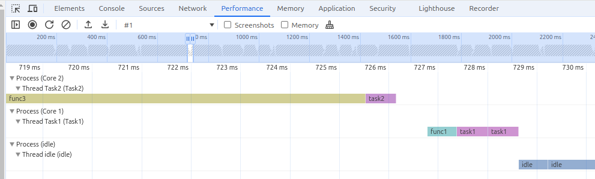

## Execution time trace chart

Create project:
cmake -S ./ --preset Debug

Build project:
cmake --build --preset Debug --parallel --target h723funrun

Clean project:
cmake --build --preset Debug --target clean

Run on https://github.com/pvvovan/rustyh7/tree/main/pcb723
stty -F /dev/ttyACM0 115200 cs8 -cstopb -parenb
cat /dev/ttyACM0 > ./stamp2plot.txt

python3 ./gentrace.py ./stamp1.txt > ./funtrace1.json
python3 ./gentrace.py ./stamp2.txt > ./funtrace2.json
python3 ./gentrace.py ./stamp3.txt > ./funtrace3.json

Load funtrace.json in performance of web browser developer tools

